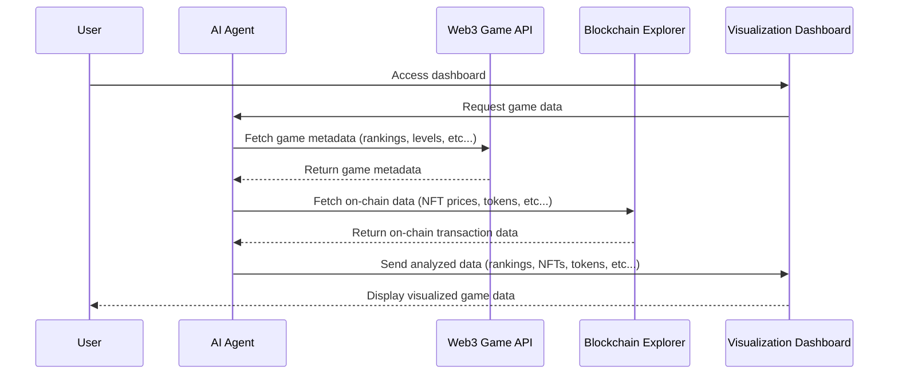

## Overview
A visualization dashboard for Web3 games that goes beyond just displaying game information is very compelling. 
By integrating on-chain transaction data such as rankings, levels, and NFT prices, and using AI agents to process and present this in an interactive, easily digestible form, you can offer much deeper insights to users, especially for games with complex economies. 

## Key Points
1. **Comprehensive Web3 Game Dashboard**  
   Our platform goes beyond simply providing game overviews. It offers an in-depth analysis of both on-chain (NFTs, tokens, TVL) and off-chain (rankings, player performance) data, delivering a holistic view of the game ecosystem.

2. **AI-Powered Insights**  
   Leveraging AI agents, the platform analyzes vast amounts of data from various Web3 games, offering real-time insights on asset prices, rankings, and in-game economy dynamics, helping users make informed decisions.

3. **Real-Time On-Chain Data Visualization**  
   We provide users with real-time tracking and visualization of token and NFT prices, marketplace activity, and on-chain transactions related to Web3 games. This makes the complex Web3 game economy more accessible and transparent.

4. **Gamified Analytics**  
   The platform transforms data analysis into a fun, interactive experience, allowing users to explore game statistics in a way that mimics the competitive and engaging nature of gaming itself.

5. **Cross-Game Comparison**  
   For users playing multiple Web3 games, the platform aggregates performance, token holdings, and NFT portfolio data across different games, allowing for seamless comparison and asset management in one place.

6. **Future Expansion into NFT Marketplaces**  
   Our platform aims to integrate with NFT marketplaces and expand asset management features, enabling users to efficiently manage all their in-game and out-of-game assets from a single, unified platform.

7. **Personalized AI Tools**  
   We plan to implement customizable AI-driven tools that offer tailored insights, helping users maximize their in-game strategy and asset management.

## Diagram

